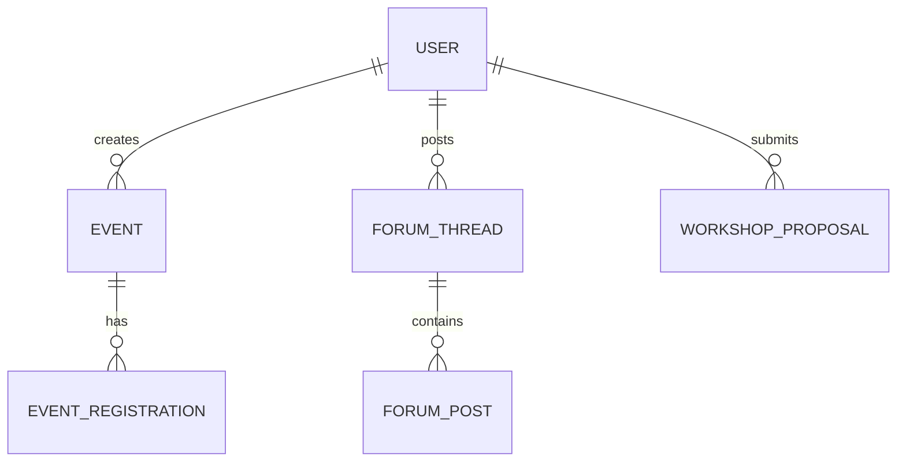
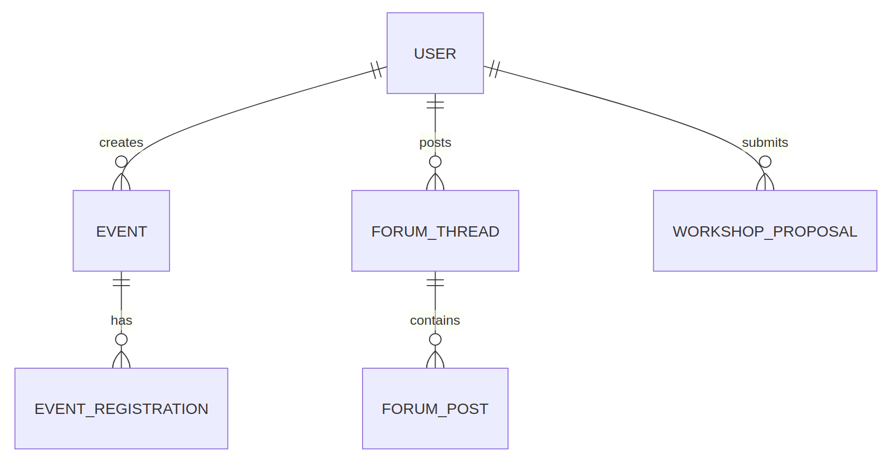

# L'Archipel Libre - Database Schema

## 🗃️ Schema Design Principles
- Normalised relational structure
- Consistent naming conventions
- Support for complex relationships
- Performance-optimized indexing

## 📊 Entity Relationship Diagram




## 🛠️ Workshop Proposal Table
``` sql
CREATE TABLE workshop_proposal (
    id UUID PRIMARY KEY,
    title VARCHAR(100) NOT NULL,
    description TEXT NOT NULL,
    proposer_id UUID REFERENCES "user"(id),
    status VARCHAR(20) DEFAULT 'PENDING',
    created_at TIMESTAMP WITH TIME ZONE DEFAULT CURRENT_TIMESTAMP,
    votes INTEGER DEFAULT 0,
    category VARCHAR(50)
);
```

## 🔗 Relationship Tables
``` sql
CREATE TABLE event_registration (
    id UUID PRIMARY KEY,
    event_id UUID REFERENCES event(id),
    user_id UUID REFERENCES "user"(id),
    registration_time TIMESTAMP WITH TIME ZONE DEFAULT CURRENT_TIMESTAMP,
    status VARCHAR(20) NOT NULL
);
```

## 📈 Indexing Strategy
``` sql
-- User Performance Indexes
CREATE INDEX idx_user_email ON "user"(email);
CREATE INDEX idx_user_username ON "user"(username);

-- Event Indexes
CREATE INDEX idx_event_time ON event(start_time, end_time);
CREATE INDEX idx_event_creator ON event(creator_id);

-- Forum Indexes
CREATE INDEX idx_forum_thread_creator ON forum_thread(creator_id);
CREATE INDEX idx_forum_post_thread ON forum_post(thread_id);
```

## 🔒 Security Considerations
- Passwords stored as bcrypt hashes
- Use of UUID for primary keys
- Timestamp fields for audit trails
- Explicit status tracking

## 📊 Data Constraints
- Email format validation
- Strong password requirements
- Role-based access control
- Time-based event constraints

## 🚀 Performance Optimisation
- Composite indexes
- Partial indexes
- Denormalisation for read-heavy operations

## 🔮 Future Schema Extensions
- Add full-text search capabilities
- Support for multilingual content
- Advanced tagging system
- Recommendation engine metadata

## 💡 Design Rationale
- Flexibility for future features
- Clear separation of concerns
- Support for complex interactions
- Scalable relationship modeling

## 🧪 Sample Data Integrity Checks
``` sql
-- Ensure event end time is after start time
ALTER TABLE event 
ADD CONSTRAINT check_event_time 
CHECK (end_time > start_time);

-- Limit username length and format
ALTER TABLE "user"
ADD CONSTRAINT username_format 
CHECK (username ~* '^[a-zA-Z0-9_]{3,50}$');
```

## 📝 Versioning and Migration
- Use Liquibase for schema migrations
- Maintain backward compatibility
- Incremental schema evolution strategy
