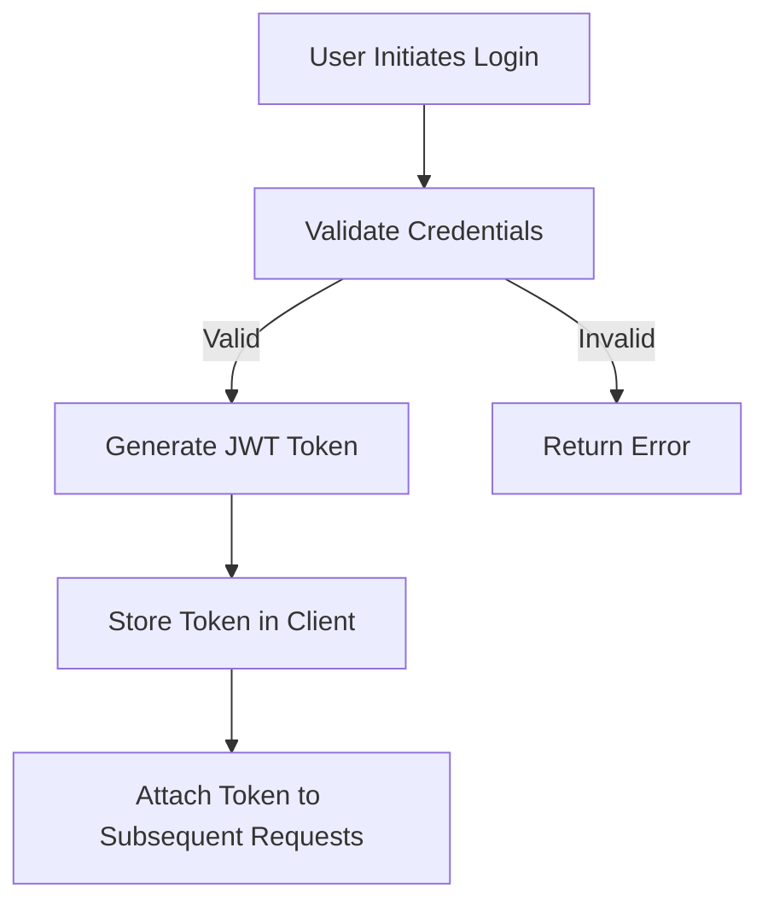
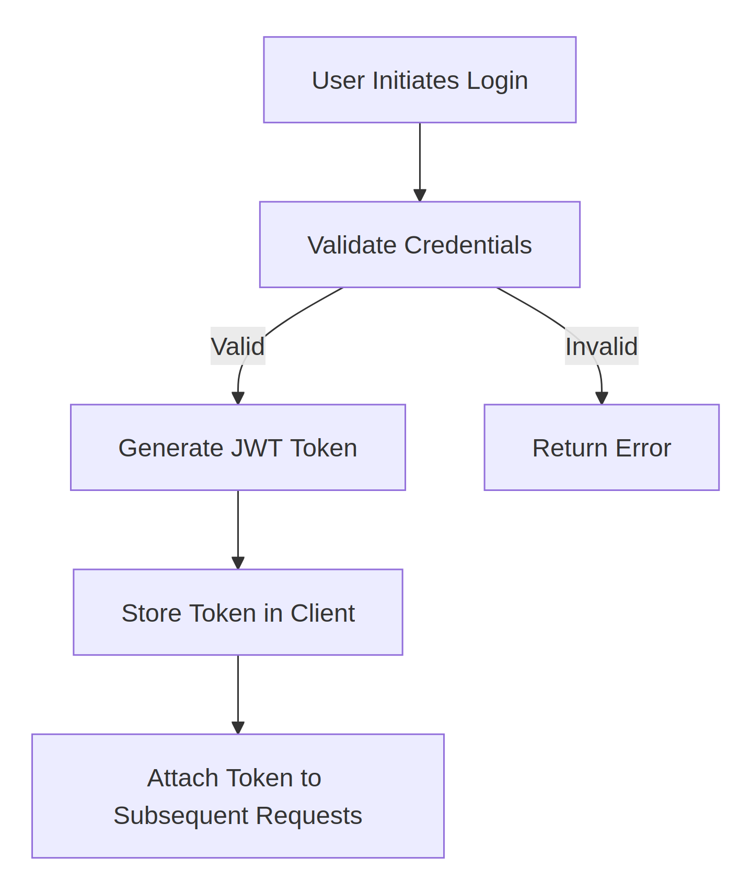
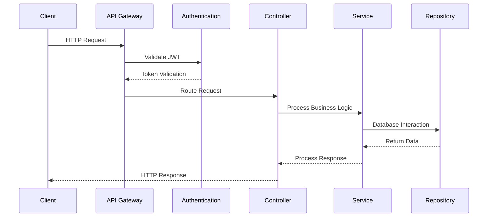
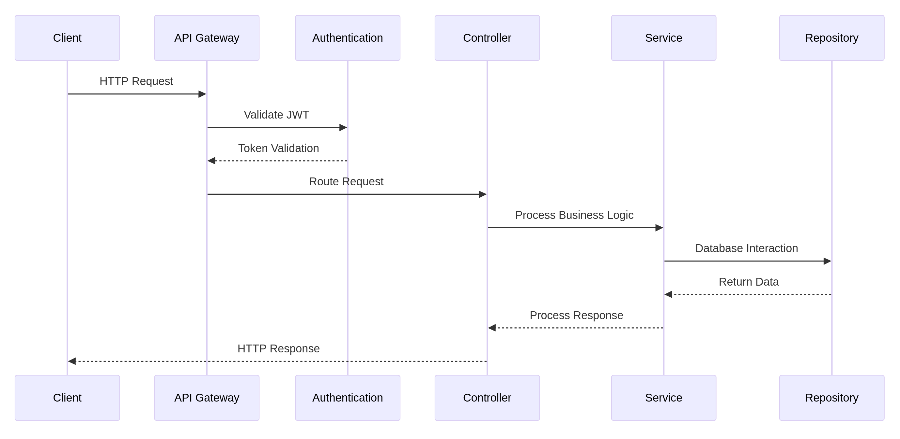

# L'Archipel Libre - System Design Document

## 🌐 System Overview
- **Purpose**: Community collaboration platform
- **Target Users**: Community members, workshop organisers
- **Core Functionality**: Event management, forum, workshop proposals

## 🏗️ High-Level Architecture
### System Components
- Frontend: Angular 17 Single Page Application (SPA)
- Backend: Spring Boot RESTful API
- Database: PostgreSQL
- Caching: Redis
- Authentication: JWT-based

## 🔐 Security Architecture
### Authentication Flow

### Authorization Levels
- Anonymous User
    - View public events
    - Read forum threads
-  User
    - Create events
    - Post in forums
    - Submit workshop proposals
- Moderator
    - Approve events
    - Moderate forum content
- Admin
    - Full system management

## 🌟 Key Design Patterns
- Repository Pattern
- Service Layer Pattern
- Dependency Injection
- CQRS (Command Query Responsibility Segregation)

## 📡 Communication Protocols
- REST API for main interactions
- WebSocket for real-time notifications
- HTTPS for all communications

## 🚦 Request Lifecycle

## 🔍 Performance Considerations
- Caching critical query results
- Pagination for large datasets
- Efficient database indexing
- Asynchronous processing for heavy tasks

## 🛡️ Fault Tolerance
- Circuit breaker patterns
- Graceful error handling
- Comprehensive logging
- Automatic service recovery

## 📊 Scalability Strategy
- Stateless authentication
- Horizontal scaling support
- Microservices-ready architecture
- Container orchestration (Kubernetes)

## 🔮 Future Expansion Points
- Microservice decomposition
- Event-driven architecture
- Machine learning recommendations
